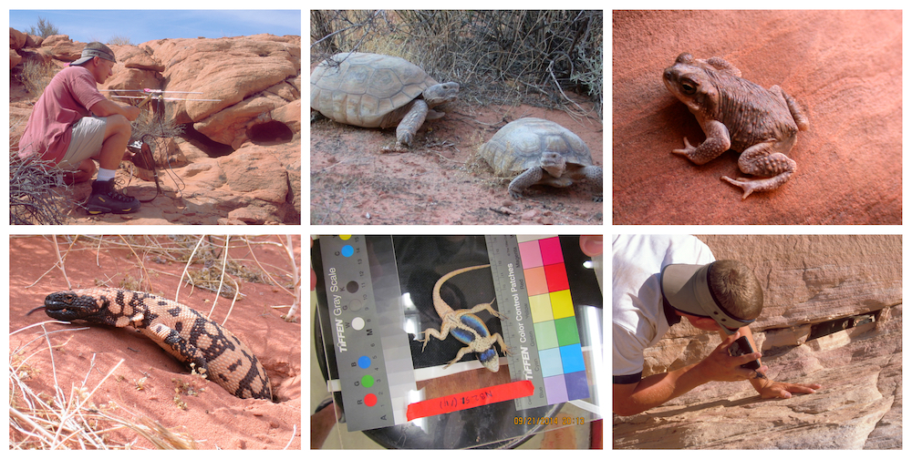

  
• Ecology of Reptiles and Amphibians

• Physiological and Evolutionary Ecology

• Habitat Modeling

• Conservation Biology

Most of my research focuses on the ecology and natural history of amphibians and reptiles. I am generally interested in how animals interact with their environment and how constraints such as temperature, energy acquisition, and water balance influence behavior, life-history, and ecology.

