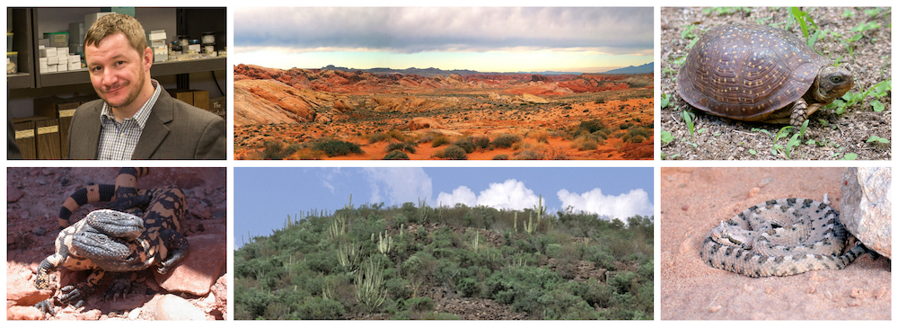

Professor of Biology and Principal Investigator in the [Center of Excellence for Field Biology](www.apsu.edu/field-biology), Austin Peay State University. 
 
 
Curator of Herpetology, [David Snyder Museum of Zoology](https://www.apsu.edu/biology/naturalhistorycollections/snydermuseumzoology/index.php)

 
 Ph.D., Ecology, Evolution, and Conservation Biology, University of Nevada, Reno. 
 M.S., Biology, University of Nevada, Reno.
 B.S., Biology, Central Washington University.
 
 
P.O. Box 4718 
Clarksville, TN 37044 
1-931-221-7076 
[email: giengerc@apsu.edu](mailto:giengerc@apsu.edu)

